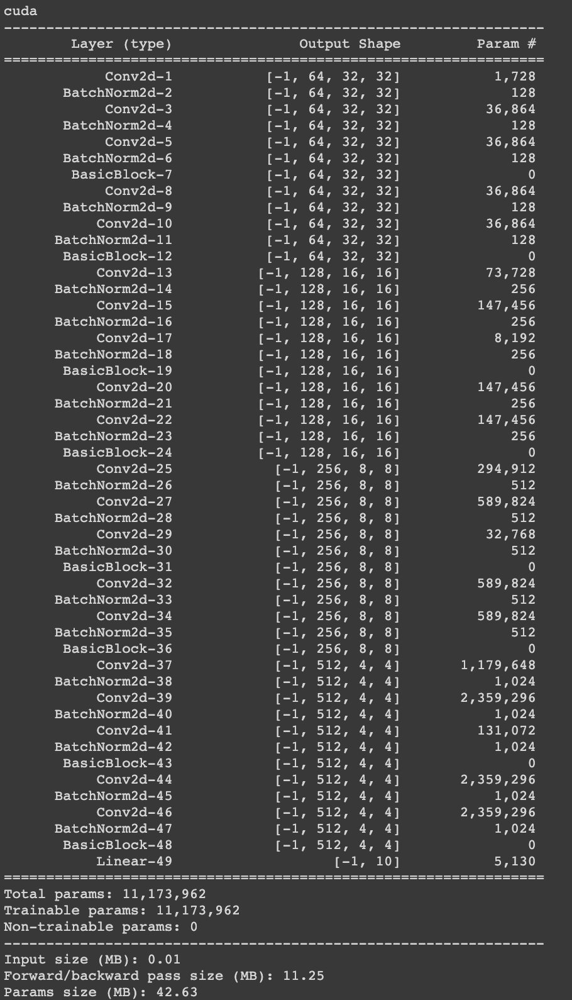

# CIFAR 10 : Classification using RESNET18

## Index  
1. [Objective](#objective)  
2. [Model Summary](#model-summary)
3. [Result Summary](#result-summary)
4. [Result Visualizations](#result-visualizations) (misclassification/accuracy/loss)

## Objective   
1. Code uses GPU - **Done**  
2. Use the architecture to C1,C2,C3,C4,O (basically 3 MPs) - **Done**  
3. Total RF must be more than 44 - **Done(RF = 96)**  
4. One of the layers must use Depthwise Separable Convolution - **Done**  
5. One of the layers must use Dilated Convolution  - **Done**  
6. Use GAP (compulsory):- add FC after GAP to target #of classes (optional) - **Done**  
7. Achieve 80% accuracy, as many epochs as you want. Total Params to be less than 1M - **Done**   
8. All the code is split and individual modules are called upon for execution - **Done**    

## Model Summary  

## Result Summary

The following image gives an idea of which model seems to achieve the best Validation Accuracy.  

Best Model based on Accuracy : **Model with L2 regularization**  
Model Parameters : **160,384**  
Receptive Field : 96  
No of Blocks : 4 Convolution blocks, 2 Transition blocks, 1 GAP block  

**In Best Model with L2 :**   

Best Train Accuracy : 83.50%  
Best Test Accuracy : 81.49%  

## Result Visualizations

### Validation Accuracy   

### Validation Loss  

### 25 misclassified images for L2 : Best Model  

