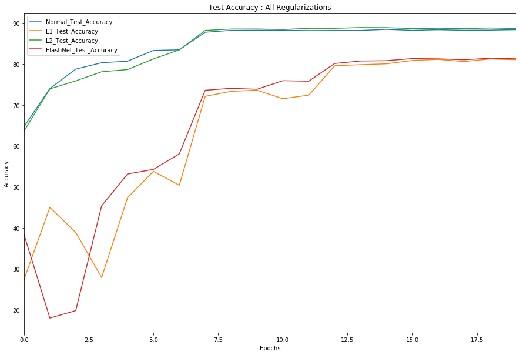
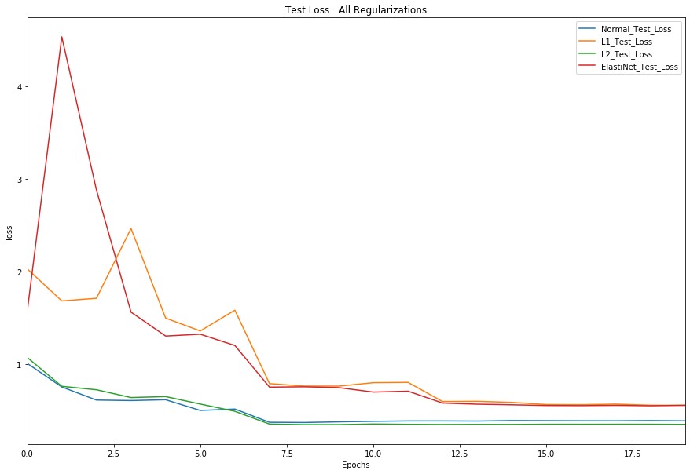
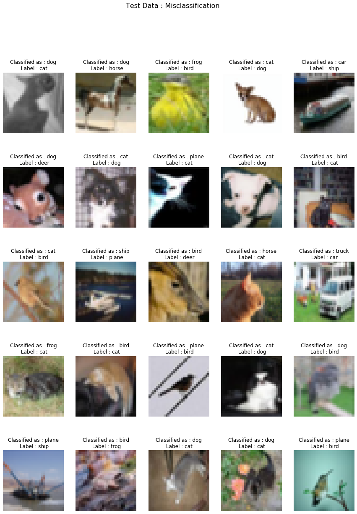

# CIFAR 10 : Classification using RESNET18

## Index  
1. [Objective](#objective)  
2. [Model Summary](#model-summary)
3. [Result Summary](#result-summary)
4. [Result Visualizations](#result-visualizations) (misclassification/accuracy/loss)

## Objective   
1. Code uses GPU - **Done**  
2. Use the RESNET18 architecture - **Done**  
3. Achieve 85% accuracy, with no limit on no of parameters - **Done**   
4. All the code is split and individual modules are called upon for execution - **Done**    

## Model Summary  

## Result Summary

The following image gives an idea of which model seems to achieve the best Validation Accuracy.

| Model | Train Accuracy | Test Accuracy | Epochs | Comments |
| --- | --- | --- | --- | --- |
| ResNet18 - Normal | **98.98** | **88.42** | 20 | Although objective is achieved, it seems to be overfit |
| ResNet18 - L1 | 82.61| 81.08 | 20 | Objective is not achieved, but seems like a good model, more epochs could meet the criterion |
| ResNet18 - L2 | **98.85** | **88.70** | 20 | Although objective is achieved, it seems to be overfit |
| ResNet18 - ElastiNet | 82.60 | 81.31 | 20 | Objective is not achieved, but seems like a good model, more epochs could meet the criterion |

## Result Visualizations

### Validation Accuracy   

### Validation Loss  

### 25 misclassified images for L2 : Best Model  

